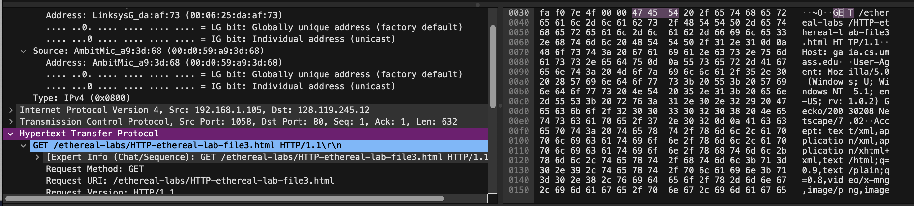
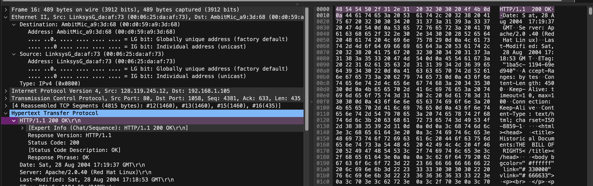
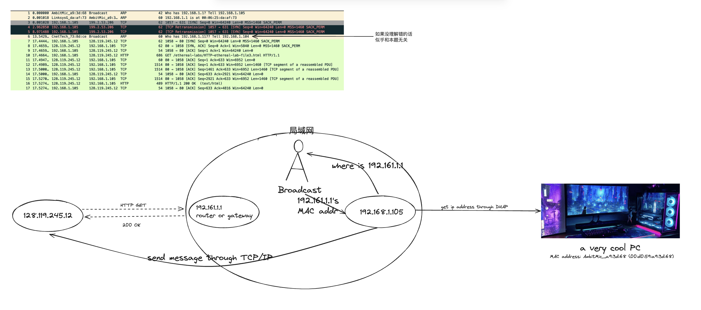
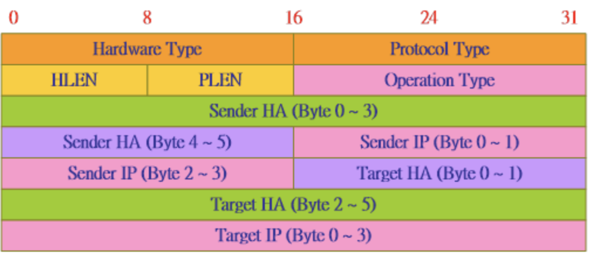

## 1: Ethernet under HTTP GET

here is the Ethernet frame contains the http respond message

```
Ethernet II, Src: AmbitMic_a9:3d:68 (00:d0:59:a9:3d:68), Dst: LinksysG_da:af:73 (00:06:25:da:af:73)
    Destination: LinksysG_da:af:73 (00:06:25:da:af:73)
        Address: LinksysG_da:af:73 (00:06:25:da:af:73)
        .... ..0. .... .... .... .... = LG bit: Globally unique address (factory default)
        .... ...0 .... .... .... .... = IG bit: Individual address (unicast)
    Source: AmbitMic_a9:3d:68 (00:d0:59:a9:3d:68)
        Address: AmbitMic_a9:3d:68 (00:d0:59:a9:3d:68)
        .... ..0. .... .... .... .... = LG bit: Globally unique address (factory default)
        .... ...0 .... .... .... .... = IG bit: Individual address (unicast)
    Type: IPv4 (0x0800)

```

> What is the 48-bit Ethernet address of your computer?

AmbitMic_a9:3d:68 (00:d0:59:a9:3d:68)


> What is the 48-bit destination address in the Ethernet frame? Is this the Ethernetaddress of gaia.cs.umass.edu? (Hint: the answer is no). What device has this as its Ethernet address? [Note: this is an important question, and one that students sometimes get wrong. Re-read pages 468-469 in the text and make sure you understand the answer here.]

- destination address in the Ethernet frame is LinksysG_da:af:73 (00:06:25:da:af:73)
- Is this the Ethernetaddress of gaia.cs.umass.edu? NO
- device is router


> Give the hexadecimal value for the two-byte Frame type field. What upper layer protocol does this correspond to?

Protocol type: IPv4 (0x0800)


> How many bytes from the very start of the Ethernet frame does the ASCII “G” in “GET” appear in the Ethernet frame?

here is G appear in the Ethernet frame?




## 2: Ethernet under HTTP OK

here is the Ethernet frame contains the http respond message

```
Ethernet II, Src: LinksysG_da:af:73 (00:06:25:da:af:73), Dst: AmbitMic_a9:3d:68 (00:d0:59:a9:3d:68)
    Destination: AmbitMic_a9:3d:68 (00:d0:59:a9:3d:68)
        Address: AmbitMic_a9:3d:68 (00:d0:59:a9:3d:68)
        .... ..0. .... .... .... .... = LG bit: Globally unique address (factory default)
        .... ...0 .... .... .... .... = IG bit: Individual address (unicast)
    Source: LinksysG_da:af:73 (00:06:25:da:af:73)
        Address: LinksysG_da:af:73 (00:06:25:da:af:73)
        .... ..0. .... .... .... .... = LG bit: Globally unique address (factory default)
        .... ...0 .... .... .... .... = IG bit: Individual address (unicast)
    Type: IPv4 (0x0800)

```

>What is the value of the Ethernet source address? Is this the address of your computer, or of gaia.cs.umass.edu (Hint: the answer is no). What device has this as its Ethernet address?

Src:LinksysG_da:af:73 (00:06:25:da:af:73), it is the address of router


>What is the destination address in the Ethernet frame? Is this the Ethernet address of your computer?

Dst: AmbitMic_a9:3d:68 (00:d0:59:a9:3d:68), and is my computer

>Give the hexadecimal value for the two-byte Frame type field. What upper layer protocol does this correspond to?

Type: IPv4 (0x0800)

>How many bytes from the very start of the Ethernet frame does the ASCII “O” in “OK” (i.e., the HTTP response code) appear in the Ethernet frame?

here is OK:



## 3:ARP caching

>Write down the contents of your computer’s ARP cache. What is the meaning of each column value?

here is my arp caching

```
➜  ~ arp -a
? (172.23.128.1) at fc:60:9b:aa:3e:1 on en0 ifscope [ethernet]
? (172.23.142.179) at b0:dc:ef:13:9f:93 on en0 ifscope [ethernet]
? (172.23.205.165) at 36:25:ff:15:f0:a5 on en0 ifscope [ethernet]
? (172.23.205.183) at cc:8:fa:65:60:2a on en0 ifscope permanent [ethernet]
? (172.23.241.229) at ac:50:de:74:a3:b7 on en0 ifscope [ethernet]
? (172.23.243.77) at b0:35:9f:a9:60:5f on en0 ifscope [ethernet]
mdns.mcast.net (224.0.0.251) at 1:0:5e:0:0:fb on en0 ifscope permanent [ethernet]
? (239.255.255.250) at 1:0:5e:7f:ff:fa on en0 ifscope permanent [ethernet]
```


## 4:More ARP

arp: IP->MAC addr



here is the arp protocol

```ARP

Address Resolution Protocol (request)
    Hardware type: Ethernet (1)
    Protocol type: IPv4 (0x0800)
    Hardware size: 6
    Protocol size: 4
    Opcode: request (1)
    Sender MAC address: AmbitMic_a9:3d:68 (00:d0:59:a9:3d:68)
    Sender IP address: 192.168.1.105
    Target MAC address: 00:00:00_00:00:00 (00:00:00:00:00:00)
    Target IP address: 192.168.1.1


```

> What are the hexadecimal values for the source and destination addresses in the Ethernet frame containing the ARP request message?

```
    Sender MAC address: AmbitMic_a9:3d:68 (00:d0:59:a9:3d:68)
    Sender IP address: 192.168.1.105
    Target MAC address: 00:00:00_00:00:00 (00:00:00:00:00:00)
    Target IP address: 192.168.1.1
```


> Give the hexadecimal value for the two-byte Ethernet Frame type field. What upper layer protocol does this correspond to?

```
Protocol type: IPv4 (0x0800)
```

### ARP in theory
>Download the ARP specification from ftp://ftp.rfc-editor.org/in-notes/std/std37.txt. A readable, detailed discussion of ARP is also at http://www.erg.abdn.ac.uk/users/gorry/course/inet-pages/arp.html.




a) How many bytes from the very beginning of the Ethernet frame does the ARP opcode field begin?

48

b) What is the value of the opcode field within the ARP-payload part of the Ethernet frame in which an ARP request is made?

Opcode: request (1)

c) Does the ARP message contain the IP address of the sender?

yes

d) Where in the ARP request does the “question” appear – the Ethernet address of the machine whose corresponding IP address is being queried?

in the target part:

```
    Target MAC address: 00:00:00_00:00:00 (00:00:00:00:00:00)
    Target IP address: 192.168.1.1
```

### More ARP in real life

Now find the ARP reply that was sent in response to the ARP request.

```

Address Resolution Protocol (reply)
    Hardware type: Ethernet (1)
    Protocol type: IPv4 (0x0800)
    Hardware size: 6
    Protocol size: 4
    Opcode: reply (2)
    Sender MAC address: LinksysG_da:af:73 (00:06:25:da:af:73)
    Sender IP address: 192.168.1.1
    Target MAC address: AmbitMic_a9:3d:68 (00:d0:59:a9:3d:68)
    Target IP address: 192.168.1.105

```

a) How many bytes from the very beginning of the Ethernet frame does the ARP opcode field begin?

48

b) What is the value of the opcode field within the ARP-payload part of the Ethernet frame in which an ARP response is made?

Opcode: reply (2)

c) Where in the ARP message does the “answer” to the earlier ARP request appear – the IP address of the machine having the Ethernet address whose corresponding IP address is being queried?

“answer”are in :

```
    Sender MAC address: LinksysG_da:af:73 (00:06:25:da:af:73)
    Sender IP address: 192.168.1.1
```

which means we known the 192.168.1.1's MAC address is 00:06:25:da:af:73


d)What are the hexadecimal values for the source and destination addresses in the Ethernet frame containing the ARP reply message? 

```
   Sender MAC address: LinksysG_da:af:73 (00:06:25:da:af:73)
    Sender IP address: 192.168.1.1
    Target MAC address: AmbitMic_a9:3d:68 (00:d0:59:a9:3d:68)
    Target IP address: 192.168.1.105
```


> Open the ethernet-ethereal-trace-1 trace file in http://gaia.cs.umass.edu/wireshark-labs/wireshark-traces.zip. The first and second ARP packets in this trace correspond to an ARP request sent by the computer running Wireshark, and the ARP reply sent to the computer running Wireshark by the computer with the ARP-requested Ethernet address. But there is yet another computer on this network, as indicated by packet 6 – another ARP request. Why is there no ARP reply (sent in response to the ARP request in packet 6) in the packet trace?

here is packet 6

```ARP

Address Resolution Protocol (request)
    Hardware type: Ethernet (1)
    Protocol type: IPv4 (0x0800)
    Hardware size: 6
    Protocol size: 4
    Opcode: request (1)
    Sender MAC address: CnetTech_73:8d:ce (00:80:ad:73:8d:ce)
    Sender IP address: 192.168.1.104
    Target MAC address: 00:00:00_00:00:00 (00:00:00:00:00:00)
    Target IP address: 192.168.1.117

```

the reason maybe there is no 192.168.1.117 in this subnet

## EXTRA CREDIT 


EX-1. The arp command:
arp -s InetAddr EtherAddr
allows you to manually add an entry to the ARP cache that resolves the IP address InetAddr to the physical address EtherAddr. What would happen if, when you manually added an entry, you entered the correct IP address, but the wrong Ethernet address for that remote interface?

your packet will be send to false Ethernet address

EX-2. What is the default amount of time that an entry remains in your ARP cache before being removed. You can determine this empirically (by monitoring the cache contents) or by looking this up in your operation system documentation. Indicate how/where you determined this value.

default ARP cache time for MACOS is 20min, according to [this post](https://apple.stackexchange.com/questions/342902/does-anybody-know-what-the-arp-cache-timeout-is-for-macos-sierra)

and if you type `man arp` on your terminal, you can see this:

```sh
HISTORY
     The arp utility appeared in 4.3BSD.
```

and we can verify the post by check [BSD's manual](https://man.openbsd.org/)
