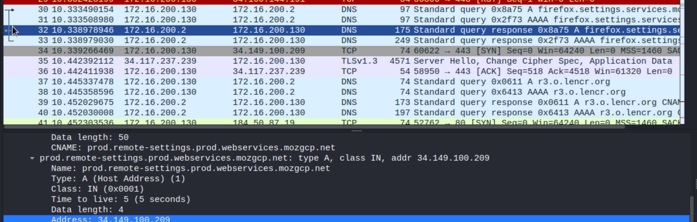
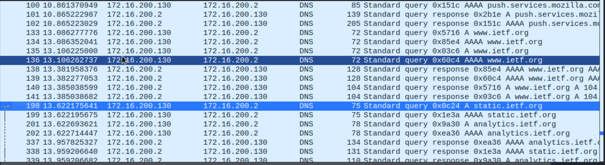
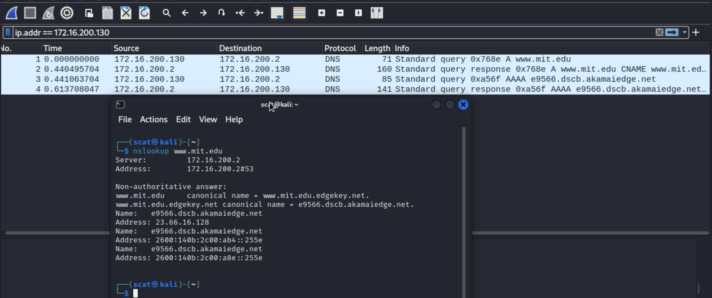
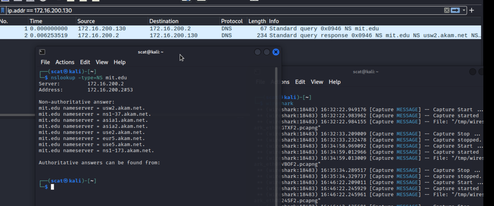

# ns-lookup 
## web server in Asia

```sh
➜  ~ nslookup www.bnu.edu.cn
Server:		172.16.213.102
Address:	172.16.213.102#53

Non-authoritative answer:
Name:	www.bnu.edu.cn
Address: 60.247.18.7
```

##  authoritative DNS servers for a university in Europe

DNS server is `ns.ethz.ch`

```sh
➜  ~ nslookup -type=NS www.ethz.ch
Server:		172.16.213.102
Address:	172.16.213.102#53

Non-authoritative answer:
*** Can't find www.ethz.ch: No answer

Authoritative answers can be found from:
ethz.ch
	origin = ns.ethz.ch
	mail addr = hostmaster.ethz.ch
	serial = 41594
	refresh = 10800
	retry = 3600
	expire = 604800
	minimum = 300
```

## mail

unfortunately it is not working

```sh
➜  ~ nslookup ns.ethz.ch www.yahoo.com
;; connection timed out; no servers could be reached

```

# ipconfig


# Tracing DNS with Wireshark

>Locate the DNS query and response messages. Are then sent over UDP or TCP?

UDP

>What is the destination port for the DNS query message? What is the source port
of DNS response message?

* destination port for the DNS query message: 53
* source port of DNS response message: 53

```DNS
Frame 1025: 78 bytes on wire (624 bits), 78 bytes captured (624 bits) on interface en0, id 0
Ethernet II, Src: Apple_65:60:2a (cc:08:fa:65:60:2a), Dst: NewH3CTe_aa:3e:01 (fc:60:9b:aa:3e:01)
Internet Protocol Version 4, Src: 172.23.205.183, Dst: 172.16.213.102
User Datagram Protocol, Src Port: 47631, Dst Port: 53
Domain Name System (query)
```

```DNS
Frame 1234: 134 bytes on wire (1072 bits), 134 bytes captured (1072 bits) on interface en0, id 0
Ethernet II, Src: NewH3CTe_aa:3e:01 (fc:60:9b:aa:3e:01), Dst: Apple_65:60:2a (cc:08:fa:65:60:2a)
Internet Protocol Version 4, Src: 172.16.213.102, Dst: 172.23.205.183
User Datagram Protocol, Src Port: 53, Dst Port: 47631
Domain Name System (response)
```

>To what IP address is the DNS query message sent? Use ipconfig to determine the IP address of your local DNS server. Are these two IP addresses the same?

DNS query were sent to 172.16.213.102

```http
1025	9.580760	172.23.205.183	172.16.213.102	DNS	78	Standard query 0x07eb AAAA analytics.ietf.org
```

my local DNS is 172.16.213.102 and they are same.

```sh
➜  ~ nslookup -type=NS localhost

Server:		172.16.213.102
Address:	172.16.213.102#53

** server can't find localhost: NXDOMAIN
```

>Examine the DNS query message. What “Type” of DNS query is it? Does the query message contain any “answers”?

we have 3 different DNS type:
* AAAA: convert domain name to IPV6 IP address
* A:convert domain name to IPV4 IP address
* HTTPS: encrypted connection

```
1025	9.580760	172.23.205.183	172.16.213.102	DNS	78	Standard query 0x07eb AAAA analytics.ietf.org
1026	9.580859	172.23.205.183	172.16.213.102	DNS	78	Standard query 0xdbab A analytics.ietf.org
1027	9.580936	172.23.205.183	172.16.213.102	DNS	78	Standard query 0x9fe2 HTTPS analytics.ietf.org
```

Query message do not contain any “answers”?(not sure)

```
Domain Name System (query)
    Transaction ID: 0xdbab
    Flags: 0x0100 Standard query
        0... .... .... .... = Response: Message is a query
        .000 0... .... .... = Opcode: Standard query (0)
        .... ..0. .... .... = Truncated: Message is not truncated
        .... ...1 .... .... = Recursion desired: Do query recursively
        .... .... .0.. .... = Z: reserved (0)
        .... .... ...0 .... = Non-authenticated data: Unacceptable
    Questions: 1
    Answer RRs: 0
    Authority RRs: 0
    Additional RRs: 0
    Queries
        analytics.ietf.org: type A, class IN
            Name: analytics.ietf.org
            [Name Length: 18]
            [Label Count: 3]
            Type: A (Host Address) (1)
            Class: IN (0x0001)
    [Response In: 1573]
```

>Examine the DNS response message. How many “answers” are provided? What do each of these answers contain?

2 answers


```
Domain Name System (response)
    Transaction ID: 0xdbab
    Flags: 0x8180 Standard query response, No error
        1... .... .... .... = Response: Message is a response
        .000 0... .... .... = Opcode: Standard query (0)
        .... .0.. .... .... = Authoritative: Server is not an authority for domain
        .... ..0. .... .... = Truncated: Message is not truncated
        .... ...1 .... .... = Recursion desired: Do query recursively
        .... .... 1... .... = Recursion available: Server can do recursive queries
        .... .... .0.. .... = Z: reserved (0)
        .... .... ..0. .... = Answer authenticated: Answer/authority portion was not authenticated by the server
        .... .... ...0 .... = Non-authenticated data: Unacceptable
        .... .... .... 0000 = Reply code: No error (0)
    Questions: 1
    Answer RRs: 2
    Authority RRs: 0
    Additional RRs: 0
    Queries
        analytics.ietf.org: type A, class IN
            Name: analytics.ietf.org
            [Name Length: 18]
            [Label Count: 3]
            Type: A (Host Address) (1)
            Class: IN (0x0001)
    Answers
        analytics.ietf.org: type A, class IN, addr 104.16.44.99
        analytics.ietf.org: type A, class IN, addr 104.16.45.99
    [Request In: 1026]
    [Time: 0.968848000 seconds]
```


>Consider the subsequent TCP SYN packet sent by your host. Does the destination IP address of the SYN packet correspond to any of the IP addresses provided in the DNS response message?

yes, we can see the answer IP address of DNS query and the IP address where TPC SYN were sent are same according to the photo


>This web page contains images. Before retrieving each image, does your host issue new DNS queries?
yes, because we can see several DNS query in one http request



# nslookup

here is an result for `nslookup www.mit.edu``


>What is the destination port for the DNS query message? What is the source port of DNS response message?
- destination port: 53
- source port : 55336

> To what IP address is the DNS query message sent? Is this the IP address of your default local DNS server?
172.16.200.2, and it's my school's DNS server
>Examine the DNS query message. What “Type” of DNS query is it? Does the query message contain any “answers”?
there are 2 types of DNS query: 
- A
- AAAA
the query message contain :answers PR = 0
```DNS

Domain Name System (query)
    Transaction ID: 0x768e
    Flags: 0x0100 Standard query
    Questions: 1
    Answer RRs: 0
    Authority RRs: 0
    Additional RRs: 0
    Queries
    [Response In: 2]

```

>Examine the DNS response message. How many “answers” are provided? What do each of these answers contain?
there are 2 types of DNS query answers: 
- A
- AAAA

as for A answer, it constains ipv4 IP address
```DNS
Answers
    www.mit.edu: type CNAME, class IN, cname www.mit.edu.edgekey.net
        Name: www.mit.edu
        Type: CNAME (Canonical NAME for an alias) (5)
        Class: IN (0x0001)
        Time to live: 5 (5 seconds)
        Data length: 25
        CNAME: www.mit.edu.edgekey.net
    www.mit.edu.edgekey.net: type CNAME, class IN, cname e9566.dscb.akamaiedge.net
        Name: www.mit.edu.edgekey.net
        Type: CNAME (Canonical NAME for an alias) (5)
        Class: IN (0x0001)
        Time to live: 5 (5 seconds)
        Data length: 24
        CNAME: e9566.dscb.akamaiedge.net
    e9566.dscb.akamaiedge.net: type A, class IN, addr 23.66.16.128
        Name: e9566.dscb.akamaiedge.net
        Type: A (Host Address) (1)
        Class: IN (0x0001)
        Time to live: 5 (5 seconds)
        Data length: 4
        Address: 23.66.16.128
```

as for AAAA answer, it constains ipv6 IP address

```DNS

Answers
    e9566.dscb.akamaiedge.net: type AAAA, class IN, addr 2600:140b:2c00:ab4::255e
        Name: e9566.dscb.akamaiedge.net
        Type: AAAA (IPv6 Address) (28)
        Class: IN (0x0001)
        Time to live: 5 (5 seconds)
        Data length: 16
        AAAA Address: 2600:140b:2c00:ab4::255e
    e9566.dscb.akamaiedge.net: type AAAA, class IN, addr 2600:140b:2c00:a8e::255e
        Name: e9566.dscb.akamaiedge.net
        Type: AAAA (IPv6 Address) (28)
        Class: IN (0x0001)
        Time to live: 5 (5 seconds)
        Data length: 16
        AAAA Address: 2600:140b:2c00:a8e::255e
```

# nsloolup -type=NS

here is my result



>To what IP address is the DNS query message sent? Is this the IP address of your default local DNS server?
172.16.200.2 and it is my default local DNS server

>Examine the DNS query message. What “Type” of DNS query is it? Does the query message contain any “answers”?
type is NS and query message contains answer PR

>Examine the DNS response message. What MIT nameservers does the response message provide? Does this response message also provide the IP addresses of the MIT namesers?

- the response message provides several answers .
- they don't contain the IP addresses of the MIT nameserver because we set the `type=NS`

```DNS
Answers
    mit.edu: type NS, class IN, ns usw2.akam.net
        Name: mit.edu
        Type: NS (authoritative Name Server) (2)
        Class: IN (0x0001)
        Time to live: 5 (5 seconds)
        Data length: 15
        Name Server: usw2.akam.net
    mit.edu: type NS, class IN, ns ns1-37.akam.net
        Name: mit.edu
        Type: NS (authoritative Name Server) (2)
        Class: IN (0x0001)
        Time to live: 5 (5 seconds)
        Data length: 9
        Name Server: ns1-37.akam.net
    mit.edu: type NS, class IN, ns asia1.akam.net
        Name: mit.edu
        Type: NS (authoritative Name Server) (2)
        Class: IN (0x0001)
        Time to live: 5 (5 seconds)
        Data length: 8
        Name Server: asia1.akam.net
    mit.edu: type NS, class IN, ns asia2.akam.net
        Name: mit.edu
        Type: NS (authoritative Name Server) (2)
        Class: IN (0x0001)
        Time to live: 5 (5 seconds)
        Data length: 8
        Name Server: asia2.akam.net
    mit.edu: type NS, class IN, ns use2.akam.net
        Name: mit.edu
        Type: NS (authoritative Name Server) (2)
        Class: IN (0x0001)
        Time to live: 5 (5 seconds)
        Data length: 7
        Name Server: use2.akam.net
    mit.edu: type NS, class IN, ns eur5.akam.net
        Name: mit.edu
        Type: NS (authoritative Name Server) (2)
        Class: IN (0x0001)
        Time to live: 5 (5 seconds)
        Data length: 7
        Name Server: eur5.akam.net
    mit.edu: type NS, class IN, ns use5.akam.net
        Name: mit.edu
        Type: NS (authoritative Name Server) (2)
        Class: IN (0x0001)
        Time to live: 5 (5 seconds)
        Data length: 7
        Name Server: use5.akam.net
    mit.edu: type NS, class IN, ns ns1-173.akam.net
        Name: mit.edu
        Type: NS (authoritative Name Server) (2)
        Class: IN (0x0001)
        Time to live: 5 (5 seconds)
        Data length: 10
        Name Server: ns1-173.akam.net
```

# nslookup-3

here is my result


>To what IP address is the DNS query message sent? Is this the IP address of your default local DNS server? If not, what does the IP address correspond to?

we send query to 172.16.200.2 and 18.0.72.3, the previous one is default local DNS server and I think second one is the ip address of bitsy.mit.edu

```DNS

bitsy.mit.edu: type A, class IN, addr 18.0.72.3
    Name: bitsy.mit.edu
    Type: A (Host Address) (1)
    Class: IN (0x0001)
    Time to live: 5 (5 seconds)
    Data length: 4
    Address: 18.0.72.3

```

>Examine the DNS query message. What “Type” of DNS query is it? Does the query message contain any “answers”?

- “Type” of DNS query are:A and AAAA
- they both contains : answer PR :0

>Examine the DNS response message. How many “answers” are provided? What does each of these answers contain?

unfortunately, 0, because we can't connected to 18.0.72.3

```sh
┌──(scat㉿kali)-[~]
└─$ nslookup www.aiit.or.kr bitsy.mit.edu  
;; communications error to 18.0.72.3#53: timed out
;; communications error to 18.0.72.3#53: timed out
;; communications error to 18.0.72.3#53: timed out
;; no servers could be reached

```
