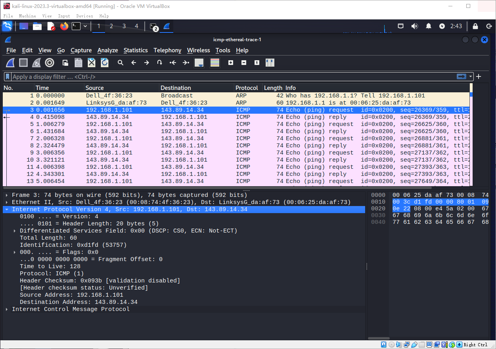
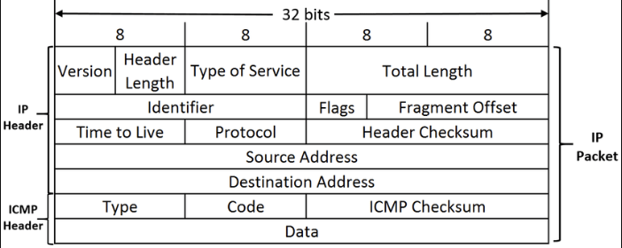
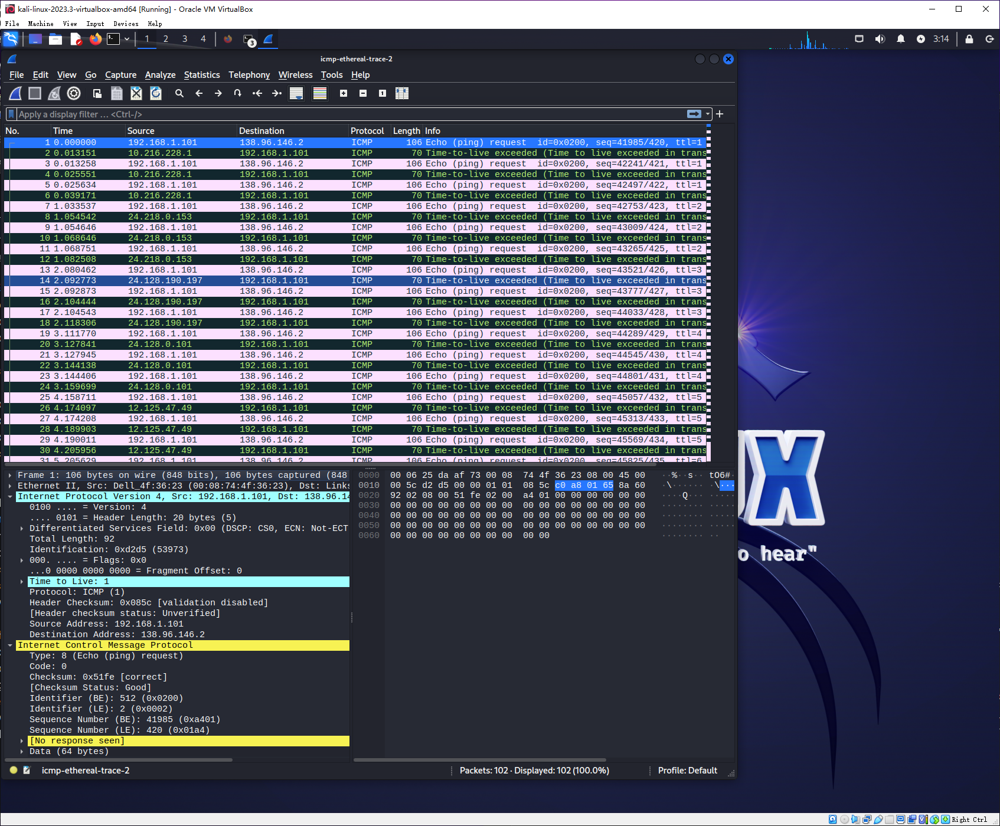
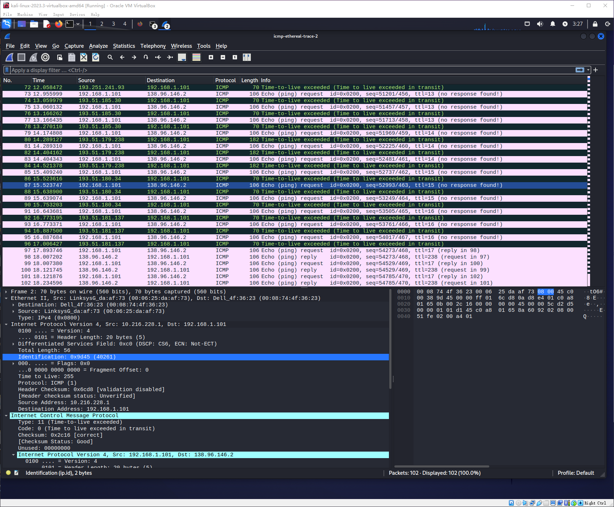
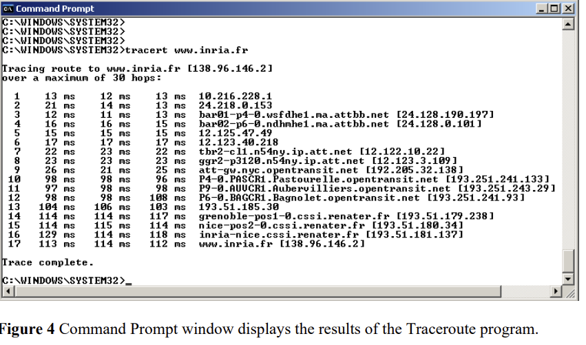

## ICMP and Ping

here is my result when ping `bnu.edu.cn`

```sh

┌──(kali㉿kali)-[~]
└─$ ping -n 10 www.bnu.edu.cn
PING www.bnu.edu.cn (60.247.18.7) 56(124) bytes of data.

```

however, I use the pcap provide by author of the book instead, here is it's screen shots



```
Internet Protocol Version 4, Src: 192.168.1.101, Dst: 143.89.14.34
    0100 .... = Version: 4
    .... 0101 = Header Length: 20 bytes (5)
    Differentiated Services Field: 0x00 (DSCP: CS0, ECN: Not-ECT)
    Total Length: 60
    Identification: 0xd1fd (53757)
    000. .... = Flags: 0x0
    ...0 0000 0000 0000 = Fragment Offset: 0
    Time to Live: 128
    Protocol: ICMP (1)
    Header Checksum: 0x093b [validation disabled]
    [Header checksum status: Unverified]
    Source Address: 192.168.1.101
    Destination Address: 143.89.14.34

```

1. What is the IP address of your host? What is the IP address of the destination host?

Src: 192.168.1.101, Dst: 143.89.14.34

2. Why is it that an ICMP packet does not have source and destination port numbers?

Because it's at the network layer rather than the transport layer

3. Examine one of the ping request packets sent by your host. What are the ICMP type and code numbers? What other fields does this ICMP packet have? How many bytes are the checksum, sequence number and identifier fields?

here is the layout of ICMP



```

Internet Control Message Protocol
    Type: 8 (Echo (ping) request)
    Code: 0
    Checksum: 0xe45a [correct]
    [Checksum Status: Good]
    Identifier (BE): 512 (0x0200)
    Identifier (LE): 2 (0x0002)
    Sequence Number (BE): 26369 (0x6701)
    Sequence Number (LE): 359 (0x0167)
    [Response frame: 4]
    Data (32 bytes)

```

type and code number:
- Type: 8 (Echo (ping) request)
- Code: 0

other field:
- Checksum: 0xe45a [correct]
- [Checksum Status: Good]
- Identifier (BE): 512 (0x0200)
- Identifier (LE): 2 (0x0002)
- Sequence Number (BE): 26369 (0x6701)
- Sequence Number (LE): 359 (0x0167)
- [Response frame: 4]
- Data (32 bytes)

length:
- checksum:2 byte
- sequence number: 2 byte
- identifier fields: 2 byte

4. Examine the corresponding ping reply packet. What are the ICMP type and code numbers? What other fields does this ICMP packet have? How many bytes are the checksum, sequence number and identifier fields?

here is ping reply:

```

Frame 4: 74 bytes on wire (592 bits), 74 bytes captured (592 bits)
Ethernet II, Src: LinksysG_da:af:73 (00:06:25:da:af:73), Dst: Dell_4f:36:23 (00:08:74:4f:36:23)
Internet Protocol Version 4, Src: 143.89.14.34, Dst: 192.168.1.101
    0100 .... = Version: 4
    .... 0101 = Header Length: 20 bytes (5)
    Differentiated Services Field: 0x00 (DSCP: CS0, ECN: Not-ECT)
    Total Length: 60
    Identification: 0xb363 (45923)
    010. .... = Flags: 0x2, Don't fragment
    ...0 0000 0000 0000 = Fragment Offset: 0
    Time to Live: 231
    Protocol: ICMP (1)
    Header Checksum: 0x80d4 [validation disabled]
    [Header checksum status: Unverified]
    Source Address: 143.89.14.34
    Destination Address: 192.168.1.101
Internet Control Message Protocol
    Type: 0 (Echo (ping) reply)
    Code: 0
    Checksum: 0xec5a [correct]
    [Checksum Status: Good]
    Identifier (BE): 512 (0x0200)
    Identifier (LE): 2 (0x0002)
    Sequence Number (BE): 26369 (0x6701)
    Sequence Number (LE): 359 (0x0167)
    [Request frame: 3]
    [Response time: 413.442 ms]
    Data (32 bytes)

```

here is ICMP type:
- Type: 0 (Echo (ping) reply)
- Code: 0

other field:
- Checksum: 0xec5a [correct]
- [Checksum Status: Good]
- Identifier (BE): 512 (0x0200)
- Identifier (LE): 2 (0x0002)
- Sequence Number (BE): 26369 (0x6701)
- Sequence Number (LE): 359 (0x0167)
- [Request frame: 3]
- [Response time: 413.442 ms]
- Data (32 bytes)

length:
- checksum:2 byte
- sequence number: 2 byte
- identifier fields: 2 byte


##  ICMP and Traceroute



5. What is the IP address of your host? What is the IP address of the target destination host?

**Src: 192.168.1.101, Dst: 138.96.146.2**

```
Frame 1: 106 bytes on wire (848 bits), 106 bytes captured (848 bits)
Ethernet II, Src: Dell_4f:36:23 (00:08:74:4f:36:23), Dst: LinksysG_da:af:73 (00:06:25:da:af:73)
Internet Protocol Version 4, Src: 192.168.1.101, Dst: 138.96.146.2
Internet Control Message Protocol
```


6. If ICMP sent UDP packets instead (as in Unix/Linux), would the IP protocol number still be 01 for the probe packets? If not, what would it be?

no, UDP'S protocol number is 17

7. Examine the ICMP echo packet in your screenshot. Is this different from the ICMP ping query packets in the first half of this lab? If yes, how so?

here is my ICMP packet

```
Internet Control Message Protocol
    Type: 8 (Echo (ping) request)
    Code: 0
    Checksum: 0x51fe [correct]
    [Checksum Status: Good]
    Identifier (BE): 512 (0x0200)
    Identifier (LE): 2 (0x0002)
    Sequence Number (BE): 41985 (0xa401)
    Sequence Number (LE): 420 (0x01a4)
    [No response seen]
    Data (64 bytes)

```

seq number, response, data are different from previous packet

8. Examine the ICMP error packet in your screenshot. It has more fields than the ICMP echo packet. What is included in those fields?

here is my ICMP error packet

```
Frame 2: 70 bytes on wire (560 bits), 70 bytes captured (560 bits)
Ethernet II, Src: LinksysG_da:af:73 (00:06:25:da:af:73), Dst: Dell_4f:36:23 (00:08:74:4f:36:23)
Internet Protocol Version 4, Src: 10.216.228.1, Dst: 192.168.1.101
    0100 .... = Version: 4
    .... 0101 = Header Length: 20 bytes (5)
    Differentiated Services Field: 0xc0 (DSCP: CS6, ECN: Not-ECT)
    Total Length: 56
    Identification: 0x9d45 (40261)
    000. .... = Flags: 0x0
    ...0 0000 0000 0000 = Fragment Offset: 0
    Time to Live: 255
    Protocol: ICMP (1)
    Header Checksum: 0x6cd8 [validation disabled]
    [Header checksum status: Unverified]
    Source Address: 10.216.228.1
    Destination Address: 192.168.1.101
Internet Control Message Protocol
    Type: 11 (Time-to-live exceeded)
    Code: 0 (Time to live exceeded in transit)
    Checksum: 0x2c16 [correct]
    [Checksum Status: Good]
    Unused: 00000000
    Internet Protocol Version 4, Src: 192.168.1.101, Dst: 138.96.146.2
        0100 .... = Version: 4
        .... 0101 = Header Length: 20 bytes (5)
        Differentiated Services Field: 0x00 (DSCP: CS0, ECN: Not-ECT)
        Total Length: 92
        Identification: 0xd2d5 (53973)
        000. .... = Flags: 0x0
        ...0 0000 0000 0000 = Fragment Offset: 0
        Time to Live: 1
        Protocol: ICMP (1)
        Header Checksum: 0xd145 [validation disabled]
        [Header checksum status: Unverified]
        Source Address: 192.168.1.101
        Destination Address: 138.96.146.2
    Internet Control Message Protocol
        Type: 8 (Echo (ping) request)
        Code: 0
        Checksum: 0x51fe [unverified] [in ICMP error packet]
        [Checksum Status: Unverified]
        Identifier (BE): 512 (0x0200)
        Identifier (LE): 2 (0x0002)
        Sequence Number (BE): 41985 (0xa401)
        Sequence Number (LE): 420 (0x01a4)

```

there is a IPV4/ICMP packet inside IPV4/ICMP packet


9. Examine the last three ICMP packets received by the source host. How are these packets different from the ICMP error packets? Why are they different?

here is the last 3 packet, they are not error.



10. Within the tracert measurements, is there a link whose delay is significantly longer than others? Refer to the screenshot in Figure 4, is there a link whose delay is significantly longer than others? On the basis of the router names, can you guess the location of the two routers on the end of this link?



according to figure 4, the link 138.96.146.2 has the longest delay, and I think the location of router is in France

