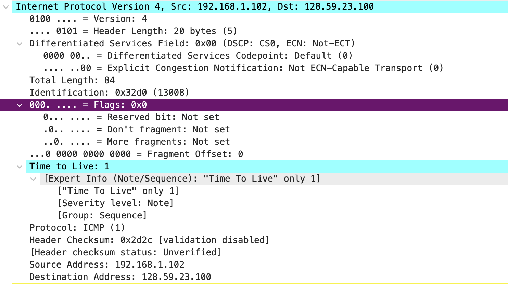
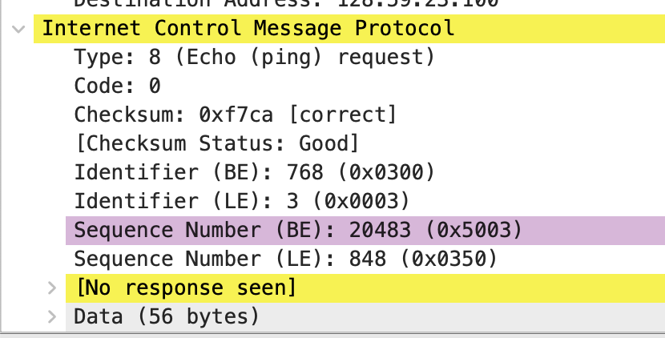
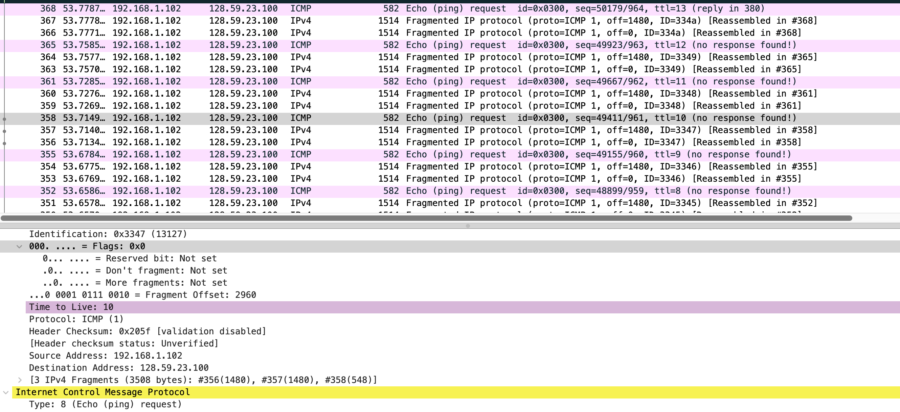
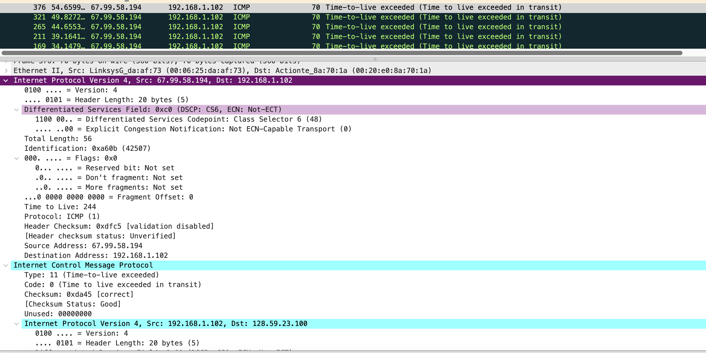

# ip and icmp

IP是一种网络层协议，负责在网络中传输数据包。它定义了如何将数据包从一个源地址传输到目标地址，通过使用IP地址来标识网络上的设备（例如计算机、路由器等）。IP协议提供了一种无连接的、不可靠的数据传输服务，它将数据包划分为较小的数据包（分组），并根据网络状况将它们逐一发送到目标地址。

ICMP是一种在IP网络上运行的协议，用于传递控制、错误和诊断消息。它提供了一种机制，使网络设备（如路由器和主机）能够相互通信并报告有关网络状况的信息。ICMP消息通常由网络设备生成，用于传递诸如网络不可达、主机不可达、超时等错误和状态信息。

ICMP常用于网络诊断工具（如ping）中，用于测试主机之间的可达性和往返延迟。当我们使用ping命令时，实际上是发送一个ICMP回显请求消息（Echo Request），并等待目标主机回复一个ICMP回显回答消息（Echo Reply）。

总结起来，IP负责数据包的传输，而ICMP则提供了一种机制，使网络设备可以从交换错误和状态信息，以及进行网络诊断和通信测试。它们是互联网通信中密切相关的两个协议。

## 1



>Select the first ICMP Echo Request message sent by your computer, and expand the Internet Protocol part of the packet in the packet details window. What is the IP address of your computer?

```ICMP
Internet Control Message Protocol
    Type: 8 (Echo (ping) request)
    Code: 0
    Checksum: 0xf7ca [correct]
    [Checksum Status: Good]
    Identifier (BE): 768 (0x0300)
    Identifier (LE): 3 (0x0003)
    Sequence Number (BE): 20483 (0x5003)
    Sequence Number (LE): 848 (0x0350)
    [No response seen]
    Data (56 bytes)

```

the IP address of "my" computer is 192.168.1.102

```IP
Internet Protocol Version 4, Src: 192.168.1.102, Dst: 128.59.23.100
    0100 .... = Version: 4
    .... 0101 = Header Length: 20 bytes (5)
    Differentiated Services Field: 0x00 (DSCP: CS0, ECN: Not-ECT)
    Total Length: 84
    Identification: 0x32d0 (13008)
    000. .... = Flags: 0x0
    ...0 0000 0000 0000 = Fragment Offset: 0
    Time to Live: 1
    Protocol: ICMP (1)
    Header Checksum: 0x2d2c [validation disabled]
    [Header checksum status: Unverified]
    Source Address: 192.168.1.102
    Destination Address: 128.59.23.100

```


>Within the IP packet header, what is the value in the upper layer protocol field?

Protocol: ICMP (1)

>How many bytes are in the IP header? How many bytes are in the payload of the IP datagram? Explain how you determined the number of payload bytes.

```
.... 0101 = Header Length: 20 bytes (5)
Total Length: 84
```

- header length is 20
- payload bytes = Total Length - header length = 64

## 2


>Has this IP datagram been fragmented? Explain how you determined whether or not the datagram has been fragmented.

no, becasue fragment offset = 0

```IP
000. .... = Flags: 0x0
    0... .... = Reserved bit: Not set
    .0.. .... = Don't fragment: Not set
    ..0. .... = More fragments: Not set

```


> Which fields in the IP datagram always change from one datagram to the next within this series of ICMP messages sent by your computer?
always change: seq number, ttl

> Which fields stay constant? Which of the fields must stay constant? Which fields must change? Why?
- must stay constant: source IP, destination, length -> because we send same request
- must change: id, seq, ttl -> because we need to identify different request

>Describe the pattern you see in the values in the Identification field of the IP datagram

id, seq, ttl are increasing

## 3


> What is the value in the Identification field and the TTL field?

```ip
Identification: 0xa60b (42507)
Time to Live: 244
```

> Do these values remain unchanged for all of the ICMP TTL-exceeded replies sent to your computer by the nearest (first hop) router? Why?

- Identification change, because we need to identify different packets
- TTL didn't change, because all packet were reach their max time limit then TTL-exceeded