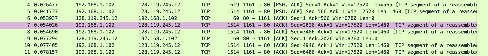
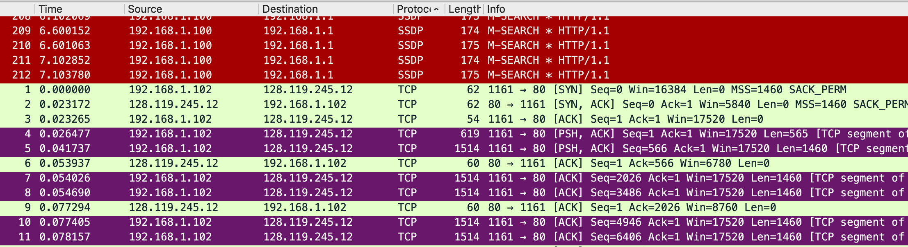
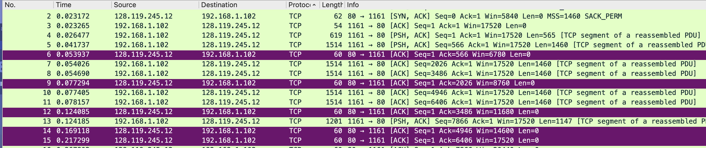

## TCP general

> What is the IP address and TCP port number used by the client computer (source) that is transferring the file to gaia.cs.umass.edu? To answer this question, it’s probably easiest to select an HTTP message and explore the details of the TCP packet used to carry this HTTP message, using the “details of the selected packet header window” refer to Figure 2 in the “Getting Started with Wireshark” Lab if you’re uncertain about the Wireshark windows.

the IP address and TCP port number used by the client computer is 192.168.1.102:1161

```capture
Internet Protocol Version 4, Src: 192.168.1.102, Dst: 128.119.245.12
Transmission Control Protocol, Src Port: 1161, Dst Port: 80, Seq: 164041, Ack: 1, Len: 50

```


> What is the IP address of gaia.cs.umass.edu? On what port number is it sending and receiving TCP segments for this connection?

128.119.245.12:80

## TCP handshake


>What is the sequence number of the TCP SYN segment that is used to initiate the TCP connection between the client computer and gaia.cs.umass.edu? What is it in the segment that identifies the segment as a SYN segment?

sequence number of the TCP SYN segment = 0

```TCP
Transmission Control Protocol, Src Port: 1161, Dst Port: 80, Seq: 0, Len: 0
    Source Port: 1161
    Destination Port: 80
    [Stream index: 0]
    [Conversation completeness: Incomplete, DATA (15)]
    [TCP Segment Len: 0]
    Sequence Number: 0    (relative sequence number) <-**SYN number**
    Sequence Number (raw): 232129012
    [Next Sequence Number: 1    (relative sequence number)]
    Acknowledgment Number: 0
    Acknowledgment number (raw): 0
    0111 .... = Header Length: 28 bytes (7)
    Flags: 0x002 (SYN)
        000. .... .... = Reserved: Not set
        ...0 .... .... = Accurate ECN: Not set
        .... 0... .... = Congestion Window Reduced: Not set
        .... .0.. .... = ECN-Echo: Not set
        .... ..0. .... = Urgent: Not set
        .... ...0 .... = Acknowledgment: Not set
        .... .... 0... = Push: Not set
        .... .... .0.. = Reset: Not set
        .... .... ..1. = Syn: Set   <-**the segment that identifies the segment as a SYN segment**
        .... .... ...0 = Fin: Not set
        [TCP Flags: ··········S·]
    Window: 16384
    [Calculated window size: 16384]
    Checksum: 0xf6e9 [unverified]
    [Checksum Status: Unverified]
    Urgent Pointer: 0
    Options: (8 bytes), Maximum segment size, No-Operation (NOP), No-Operation (NOP), SACK permitted
    [Timestamps]

```


>What is the sequence number of the SYNACK segment sent by gaia.cs.umass.edu to the client computer in reply to the SYN? What is the value of the Acknowledgement field in the SYNACK segment? How did gaia.cs.umass.edu determine that value? What is it in the segment that identifies the segment as a SYNACK segment?

sequence number of the SYNACK segment = 0
Acknowledgement field = sequence number of the TCP SYN segment + 1 = 1

```TCP
Flags: 0x012 (SYN, ACK)
    000. .... .... = Reserved: Not set
    ...0 .... .... = Accurate ECN: Not set
    .... 0... .... = Congestion Window Reduced: Not set
    .... .0.. .... = ECN-Echo: Not set
    .... ..0. .... = Urgent: Not set
    .... ...1 .... = Acknowledgment: Set  <-ACK
    .... .... 0... = Push: Not set
    .... .... .0.. = Reset: Not set
    .... .... ..1. = Syn: Set <- SYN
    .... .... ...0 = Fin: Not set
    [TCP Flags: ·······A··S·]

```


> What is the sequence number of the TCP segment containing the HTTP POST command? Note that in order to find the POST command, you’ll need to dig into the packet content field at the bottom of the Wireshark window, looking for a segment with a “POST” within its DATA field.

sequence number of the TCP segment containing the HTTP POST command = 1

is POST in first tcp packet? 

```capture
Frame 199: 104 bytes on wire (832 bits), 104 bytes captured (832 bits)
Ethernet II, Src: Actionte_8a:70:1a (00:20:e0:8a:70:1a), Dst: LinksysG_da:af:73 (00:06:25:da:af:73)
Internet Protocol Version 4, Src: 192.168.1.102, Dst: 128.119.245.12
Transmission Control Protocol, Src Port: 1161, Dst Port: 80, Seq: 164041, Ack: 1, Len: 50
[122 Reassembled TCP Segments (164090 bytes): #4(565), #5(1460), #7(1460), #8(1460), #10(1460), #11(1460), #13(1147), #18(1460), #19(1460), #20(1460), #21(1460), #22(1460), #23(892), #30(1460), #31(1460), #32(1460), #33(1460), #34(1460), #3]
Hypertext Transfer Protocol
MIME Multipart Media Encapsulation, Type: multipart/form-data, Boundary: "---------------------------265001916915724"

```


> Consider the TCP segment containing the HTTP POST as the first segment in the TCP connection. What are the sequence numbers of the first six segments in the TCP connection (including the segment containing the HTTP POST)? 



- the sequence numbers of the first six segments in the TCP connections are: 1, 566, 2026, 3086, 4946, 6406

>At what time was each segment sent? 

- send times are in the photo(selected packet)


>When was the ACK for each segment received? 

- ACK receive times are in the photo(selected packet)



>Given the difference between when each TCP segment was sent, and when its acknowledgement was received, what is the RTT value for each of the six segments? 

- the RTT value for each of the six segments are [iRTT: 0.023265000 seconds]


>What is the EstimatedRTT value (see Section 3.5.3, page 242 in text) after the receipt of each ACK? 

//todo，我无法查看tcp流图

>Assume that the value of the EstimatedRTT is equal to the measured RTT for the first segment, and then is computed using the EstimatedRTT equation on page 242 for all subsequent segments.

//todo

Note: Wireshark has a nice feature that allows you to plot the RTT for each of the TCP segments sent. Select a TCP segment in the “listing of captured packets” window that is being sent from the client to the gaia.cs.umass.edu server. Then select: Statistics->TCP Stream Graph- >Round Trip Time Graph.

> What is the length of each of the first six TCP segments?

619, 1514, 1514, 1514, 1514, 1514


>What is the minimum amount of available buffer space advertised at the received for the entire trace? Does the lack of receiver buffer space ever throttle the sender?

```TCP
206	5.651141	192.168.1.102	128.119.245.12	TCP	54	1161 → 80 [ACK] Seq=164091 Ack=731 Win=16790 Len=0
```
- the minimum amount of available buffer space is 16790
- no


> Are there any retransmitted segments in the trace file? What did you check for (in the trace) in order to answer this question?

There are no retransmitted segments because all TPDU seq number are increase.


> How much data does the receiver typically acknowledge in an ACK? Can you identify cases where the receiver is ACKing every other received segment (see Table 3.2 on page 250 in the text).

the data size receiver typically acknowledge in an ACK, is always size of TPDU

> What is the throughput (bytes transferred per unit time) for the TCP connection? Explain how you calculated this value.

packet 4 ~ 50 were sent in 1 second, the packet 50's ack number is 29777, which means TCP connection send 29777 Byte/second