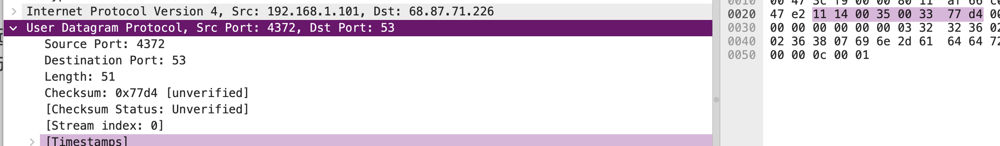

>Select one UDP packet from your trace. From this packet, determine how many fields there are in the UDP header. (You shouldn’t look in the textbook! Answer these questions directly from what you observe in the packet trace.) Name these fields.

4 header fields:
- Source Port: 4372
- Destination Port: 53
- Length: 51
- Checksum: 0x77d4 [unverified]

```UDP
User Datagram Protocol, Src Port: 4372, Dst Port: 53
    Source Port: 4372
    Destination Port: 53
    Length: 51
    Checksum: 0x77d4 [unverified]
    [Checksum Status: Unverified]
    [Stream index: 0]
    [Timestamps]
    UDP payload (43 bytes)

```


>By consulting the displayed information in Wireshark’s packet content field for this packet, determine the length (in bytes) of each of the UDP header fields. The value in the Length field is the length of what? (You can consult the text for this answer). Verify your claim with your captured UDP packet.



length (in bytes) of each of the UDP header fields $ 4 \time 4 \times 4 \div 8 byte = 8 byte$

>What is the maximum number of bytes that can be included in a UDP payload? (Hint: the answer to this question can be determined by your answer to 2. above) What is the largest possible source port number? (Hint: see the hint in 4.)

max_length = $ 2^16 = 65,535 bytes$


>What is the protocol number for UDP? Give your answer in both hexadecimal and decimal notation. To answer this question, you’ll need to look into the Protocol field of the IP datagram containing this UDP segment (see Figure 4.13 in the text, and the discussion of IP header fields).

protocol number = 17

```IP
Protocol: UDP (17)
```


>Examine a pair of UDP packets in which your host sends the first UDP packet and the second UDP packet is a reply to this first UDP packet. (Hint: for a second packet to be sent in response to a first packet, the sender of the first packet should be the destination of the second packet). Describe the relationship between the port numbers in the two packets.

the relationship between the port numbers in the two packets are reversed 

```UDP
User Datagram Protocol, Src Port: 4372, Dst Port: 53
User Datagram Protocol, Src Port: 53, Dst Port: 4372
```

