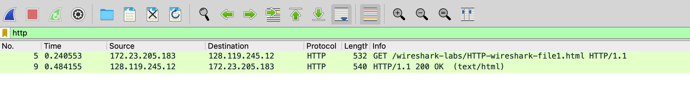
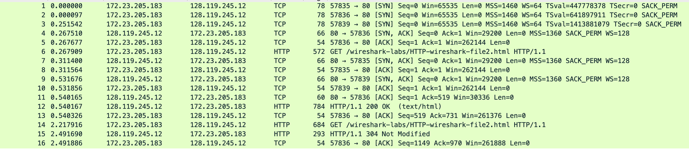
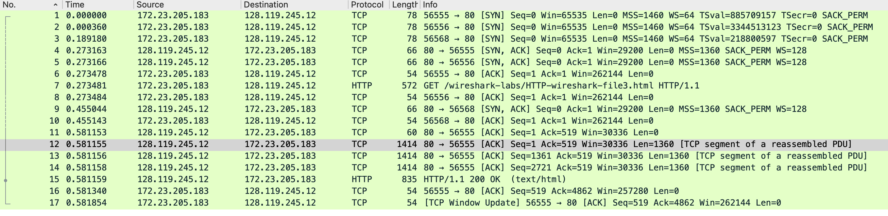
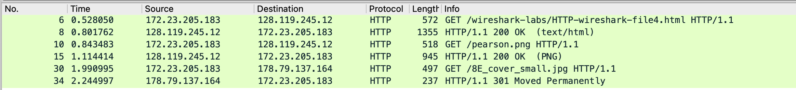
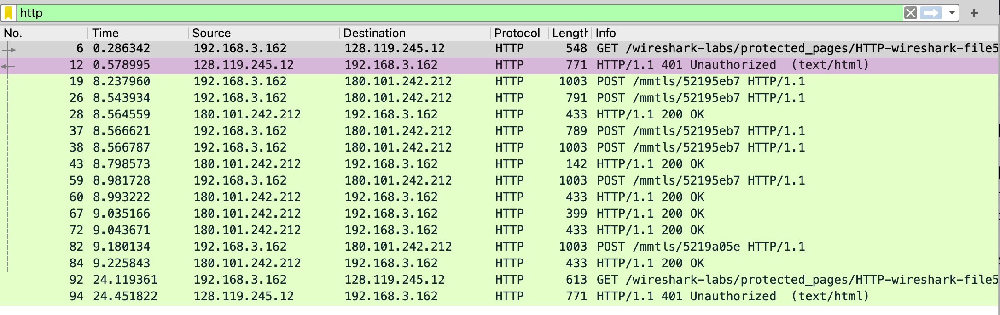

# The Basic HTTP GET/response interaction

here is my result:



we can see there are 2 HTTP messages:
* HTTP GET
* HTTP response OK

here is get message:

```http
Frame 5: 532 bytes on wire (4256 bits), 532 bytes captured (4256 bits) on interface en0, id 0
Ethernet II, Src: Apple_65:60:2a (cc:08:fa:65:60:2a), Dst: NewH3CTe_aa:3e:01 (fc:60:9b:aa:3e:01)
Internet Protocol Version 4, Src: 172.23.205.183, Dst: 128.119.245.12
Transmission Control Protocol, Src Port: 55540, Dst Port: 80, Seq: 1, Ack: 1, Len: 478
Hypertext Transfer Protocol
    GET /wireshark-labs/HTTP-wireshark-file1.html HTTP/1.1\r\n
        [Expert Info (Chat/Sequence): GET /wireshark-labs/HTTP-wireshark-file1.html HTTP/1.1\r\n]
            [GET /wireshark-labs/HTTP-wireshark-file1.html HTTP/1.1\r\n]
            [Severity level: Chat]
            [Group: Sequence]
        Request Method: GET
        Request URI: /wireshark-labs/HTTP-wireshark-file1.html
        Request Version: HTTP/1.1
    Host: gaia.cs.umass.edu\r\n
    Connection: keep-alive\r\n
    Upgrade-Insecure-Requests: 1\r\n
    User-Agent: Mozilla/5.0 (Macintosh; Intel Mac OS X 10_15_7) AppleWebKit/537.36 (KHTML, like Gecko) Chrome/118.0.0.0 Safari/537.36\r\n
    Accept: text/html,application/xhtml+xml,application/xml;q=0.9,image/avif,image/webp,image/apng,*/*;q=0.8,application/signed-exchange;v=b3;q=0.7\r\n
    Accept-Encoding: gzip, deflate\r\n
    Accept-Language: zh-CN,zh;q=0.9\r\n
    \r\n
    [Full request URI: http://gaia.cs.umass.edu/wireshark-labs/HTTP-wireshark-file1.html]
    [HTTP request 1/1]
    [Response in frame: 9]
```

here is http response
```http
Frame 9: 540 bytes on wire (4320 bits), 540 bytes captured (4320 bits) on interface en0, id 0
Ethernet II, Src: NewH3CTe_aa:3e:01 (fc:60:9b:aa:3e:01), Dst: Apple_65:60:2a (cc:08:fa:65:60:2a)
Internet Protocol Version 4, Src: 128.119.245.12, Dst: 172.23.205.183
Transmission Control Protocol, Src Port: 80, Dst Port: 55540, Seq: 1, Ack: 479, Len: 486
Hypertext Transfer Protocol
    HTTP/1.1 200 OK\r\n
    Date: Fri, 27 Oct 2023 04:24:25 GMT\r\n
    Server: Apache/2.4.6 (CentOS) OpenSSL/1.0.2k-fips PHP/7.4.33 mod_perl/2.0.11 Perl/v5.16.3\r\n
    Last-Modified: Thu, 26 Oct 2023 05:59:02 GMT\r\n
    ETag: "80-6089844c7567c"\r\n
    Accept-Ranges: bytes\r\n
    Content-Length: 128\r\n
    Keep-Alive: timeout=5, max=100\r\n
    Connection: Keep-Alive\r\n
    Content-Type: text/html; charset=UTF-8\r\n
    \r\n
    [HTTP response 1/1]
    [Time since request: 0.243602000 seconds]
    [Request in frame: 5]
    [Request URI: http://gaia.cs.umass.edu/wireshark-labs/HTTP-wireshark-file1.html]
    File Data: 128 bytes
Line-based text data: text/html (4 lines)

```

# Q&A
## Q1
>Is your browser running HTTP version 1.0 or 1.1? What version of HTTP is the server running?
version 1.1
```
GET /wireshark-labs/HTTP-wireshark-file1.html HTTP/1.1\r\n
```

## Q2
>What languages (if any) does your browser indicate that it can accept to the server?
my broswer accept zh-CN(Chinese)

```
Accept: text/html,application/xhtml+xml,application/xml;q=0.9,image/avif,image/webp,image/apng,*/*;q=0.8,application/signed-exchange;v=b3;q=0.7\r\n
Accept-Encoding: gzip, deflate\r\n
Accept-Language: zh-CN,zh;q=0.9\r\n
```

## Q3
>What is the IP address of your computer? Of the gaia.cs.umass.edu server?

* my IP:172.23.205.183
* gaia.cs.umass.edu server IP:28.119.245.12

```
Internet Protocol Version 4, Src: 172.23.205.183, Dst: 128.119.245.12
```

## Q4
>What is the status code returned from the server to your browser?
200 
```
HTTP/1.1 200 OK\r\n
```

## Q5
>When was the HTML file that you are retrieving last modified at the server?
Thu, 26 Oct 2023 05:59:02 GMT

```
Last-Modified: Thu, 26 Oct 2023 05:59:02 GMT\r\n
```
## Q6
>How many bytes of content are being returned to your browser?
540 bytes
```
Frame 9: 540 bytes on wire (4320 bits), 540 bytes captured (4320 bits) on interface en0, id 0
```

## Q7
>By inspecting the raw data in the packet content window, do you see any headers within the data that are not displayed in the packet-listing window? If so, name one.
NO?

# The HTTP CONDITIONAL GET/response interaction



## Q8 
>Inspect the contents of the first HTTP GET request from your browser to the server. Do you see an “IF-MODIFIED-SINCE” line in the HTTP GET?
no

## Q9
>Inspect the contents of the server response. Did the server explicitly return the contents of the file? How can you tell?

I think server explicitly return the contents of the file, since the length of the response is 730

```
Transmission Control Protocol, Src Port: 80, Dst Port: 57836, Seq: 1, Ack: 519, Len: 730
```

## Q10 

>Now inspect the contents of the second HTTP GET request from your browser to the server. Do you see an “IF-MODIFIED-SINCE:” line in the HTTP GET? If so, what information follows the “IF-MODIFIED-SINCE:” header?

Yes and the following information is time I send previous GET request.

```
If-Modified-Since: Fri, 27 Oct 2023 05:59:02 GMT\r\n
```

## Q11
>What is the HTTP status code and phrase returned from the server in response to this second HTTP GET? Did the server explicitly return the contents of the file? Explain

status code is `[HTTP/1.1 304 Not Modified\r\n]` and server not explicitly returnt he content since the length of HTTP response is 239, which is less than 730
```
[HTTP/1.1 304 Not Modified\r\n]
...
Transmission Control Protocol, Src Port: 80, Dst Port: 57836, Seq: 731, Ack: 1149, Len: 239

```


# Retrieving Long Documents

## Q12
>How many HTTP GET request messages did your browser send? Which packet number in the trace contains the GET message for the Bill or Rights?
* 1 HTTP GET request 
* packet number 7

## Q13
>Which packet number in the trace contains the status code and phrase associated with the response to the HTTP GET request?
packet number 12,13,14,15
```
[4 Reassembled TCP Segments (4861 bytes): #12(1360), #13(1360), #14(1360), #15(781)]
    [Frame: 12, payload: 0-1359 (1360 bytes)]
    [Frame: 13, payload: 1360-2719 (1360 bytes)]
    [Frame: 14, payload: 2720-4079 (1360 bytes)]
    [Frame: 15, payload: 4080-4860 (781 bytes)]
    [Segment count: 4]
    [Reassembled TCP length: 4861]
    [Reassembled TCP Data: 485454502f312e3120323030204f4b0d0a446174653a204672692c203237204f63742032…]
```

## Q14
>What is the status code and phrase in the response?
200 OK
```
HTTP/1.1 200 OK\r\n
    [Expert Info (Chat/Sequence): HTTP/1.1 200 OK\r\n]
        [HTTP/1.1 200 OK\r\n]
        [Severity level: Chat]
        [Group: Sequence]
    Response Version: HTTP/1.1
    Status Code: 200
    [Status Code Description: OK]
    Response Phrase: OK
```
## Q15
>How many data-containing TCP segments were needed to carry the single HTTP response and the text of the Bill of Rights?
4
```
[4 Reassembled TCP Segments (4861 bytes): #12(1360), #13(1360), #14(1360), #15(781)]
    [Frame: 12, payload: 0-1359 (1360 bytes)]
    [Frame: 13, payload: 1360-2719 (1360 bytes)]
    [Frame: 14, payload: 2720-4079 (1360 bytes)]
    [Frame: 15, payload: 4080-4860 (781 bytes)]
    [Segment count: 4]
    [Reassembled TCP length: 4861]
    [Reassembled TCP Data: 485454502f312e3120323030204f4b0d0a446174653a204672692c203237204f63742032…]
```

# HTML Documents with Embedded Objects



## Q16
>How many HTTP GET request messages did your browser send? To which Internet addresses were these GET requests sent?
3 HTTP GET request and they are send to
* `Host: gaia.cs.umass.edu\r\n`
* `Host: gaia.cs.umass.edu\r\n`
* `Host: kurose.cslash.net\r\n`

This is slightly different from the pdf description of v8.0, the cover's src is changed from`caite.cs.umass.edu`to`kurose.cslash.net`.

here is HTML source code:

```html
<!-- publisher’s logo  -->

<!-- cover  -->

```
## Q17
>Can you tell whether your browser downloaded the two images serially, or whether they were downloaded from the two web sites in parallel? Explain.
I guess browser downloaded the two images serially(but not quite sure), for the reasons that as for time displayed by wireshark, the GET request were not sent at same time


#  HTTP Authentication


## Q18

> What is the server’s response (status code and phrase) in response to the initial HTTP GET message from your browser?

200OK

## Q19
>When your browser’s sends the HTTP GET message for the second time, what new field is included in the HTTP GET message?
Authorization field
```http
Authorization: Basic YWRtaW46MTIzNDU2\r\n
    Credentials: admin:123456

```