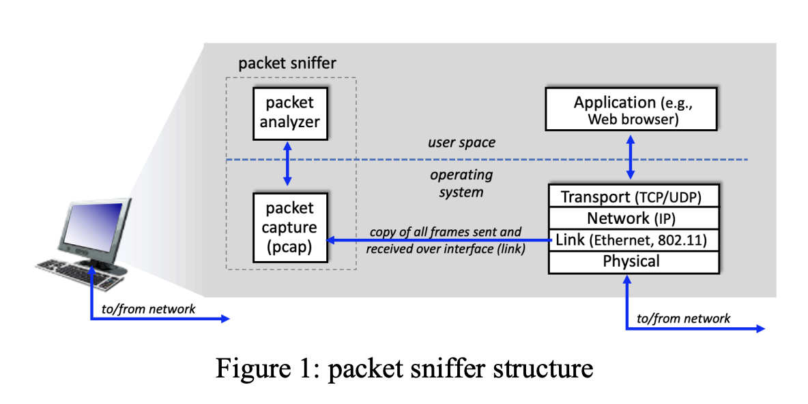

# packet sniffer
A packetsniffer itself is passive. It observes messages being sent and received by applications and protocols running on your computer, but never sends packets itself. Similarly, received packets are never explicitly addressed to the packet sniffer. Instead, a packet sniffer receives a copy of packets that are sent/received from/by application and protocols executing on your machine.

component:
* packet capture library
* packet analyzer

